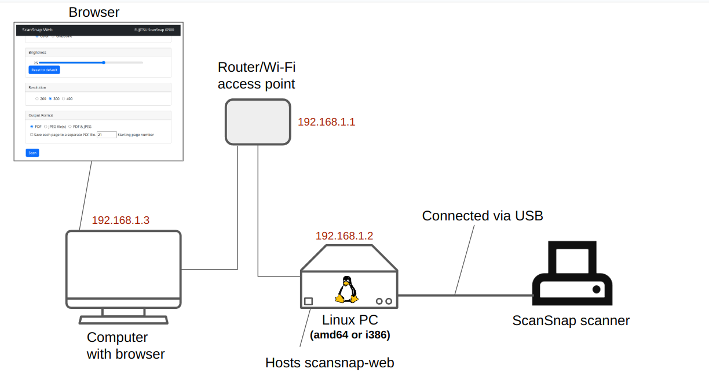

# ScanSnap Web

An application to use a Fujitsu's ScanSnap scanner from browsers.

## Background
ScanSnap scanners are a line of compact and handy home scanner products made by Fujitsu. Fujitsu provides drivers for Windows and Linux, but GUI is only available on Windows. This application provides a Web-based GUI to control a ScanSnap scanner over the network (within the same subnet) and is designed to run on a small form factor Linux PC* or a laptop/desktop Linux PC. For the moment, the application is mainly intended to be used on a small local network and is mostly for a personal use.

\*These PCs are often colloquially called 'mini PCs' or 'Linux box'.

## Requirements:
### Server
- An i386/amd64 PC running Linux (tested with Ubuntu 18.04 LTS and Debian 10)
- The following packages need to be installed on a PC that satisfies the requirement above:
  - Official ScanSnap driver from Fujitsu's website
  - ImageMagick (for generating PDF files from jpeg images)
  - Python 3.6 or higher

### Client
- A device with a display, e.g. a smartphone, tablet, or laptop, with a modern web browser

## Tips
- Note that Fujitsu provides Linux drivers for computers with **i386** and **amd64 (x86_64)** architectures, but **NOT for ARM architecture machines** (last confirmed in early 2019). As such, this application does not run on Raspberry Pi devices (I tried the driver with a Pi 3 and confirmed that it does not work).
